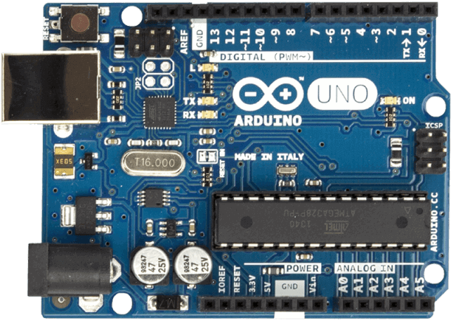
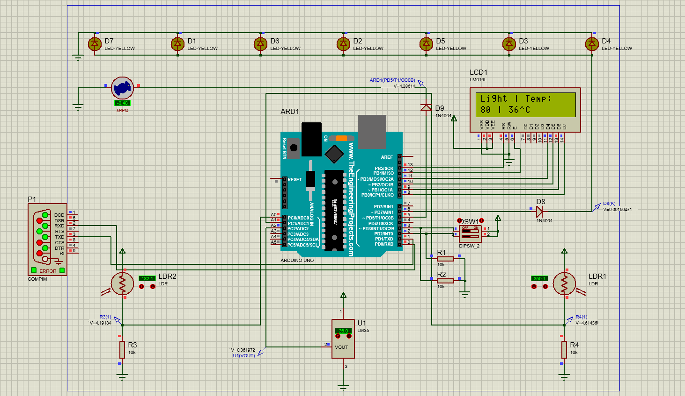

# Room Management System with Arduino Uno

[]()
[](LICENSE)
[](LICENSE)

## Overview
Arduino Uno is a microcontroller board that can be used to create automated systems for room management. It enables users to program and control different devices and appliances in the room, such as lights, fans, air conditioners, and more. With Arduino Uno, users can create their own customized solutions for their home or office space. This technology has become increasingly popular due to its simplicity and affordability. It allows users to automate various tasks without having to purchase expensive equipment or hire an expert technician. Arduino Uno can be used for various purposes such as controlling lights, temperature sensors, and other devices in a room. Additionally, it can be used for security purposes by setting up motion sensors or door locks triggered by specific events or conditions. 
<p align="center">
  
</p>

***You can see the design [here](design/).***

<p align="center">
  
</p>

## Project description
We want to make a device for light and temperature management using the Arduino board in the Proteus environment. The device in question should be able to work in both automatic and manual modes. More information is in `Table (1)`.

To measure the amount of light, you have two photocells that measure the light intensity at two different points of the environment.

To control the amount, the light of the lighting system is connected to one of the `PWM pins` of the board so that the ambient light can be controlled accurately. (`Table 2`)

LM35 analog sensor is responsible for temperature measurement. is.

To change and reduce the ambient temperature of the ventilation system, it is connected to one of the `PWM pins` of the board. The power of the ventilation system must be adjustable. (`Table 3`)

Also, the temperature and the amount of light are sent to the laptop every two seconds through the serial port (`UART`).

The working mode of the device is determined by two dip switches which are connected to bases 2 and 3 and according to table 1.
<div align="center">
  
  
| Pins status | mode |
:------------:|:-----:
D2 = 0, D3 = 0    |Automatic light control <br>Automatic temperature control
D2 = 0, D3 = 1    |Manual light control <br>Automatic temperature control
D2 = 1, D3 = 0    |Automatic light control <br>Manual temperature control
D2 = 1, D3 = 1    |Manual light control <br>Manual temperature control
  
*Table 1*

</div>

### Automatic mode

When the device is in automatic mode, the lighting or ventilation system operates according to tables 2 and 3. Also, the temperature and light level are sent to the laptop every two seconds.

<div align="center">
  
  
| Temperature range | The power of the ventilation device |
:------------:|:-----:
30 < Temperature < 35   | 30 percent
35 < Temperature < 40   |50 percent
40 < Temperature < 45   |70 percent
45 < Temperature < 50   |100 percent
  
*Table 2 (The power of the ventilation device determined by the Cycle Duty. The temperature unit is Celsius)*

</div>

The air conditioner turns off when the temperature reaches 25 degrees Celsius.

<div align="center">
  
  
| The amount of light measured by the photocell | Light intensity of the lighting system |
:------------:|:-----:
0 < Temperature < 25   | 100 percent
25 < Temperature < 50   |75 percent
50 < Temperature < 75   |50 percent
75 < Temperature < 100  |25 percent
  
*Table 3: The light intensity of the lighting system is determined by the Cycle Duty.*

</div>

### manual mode

Using one of the programming languages, design software that sends data to the board through the serial port (`UART`) and also receives data from the board.

When the device is in manual mode, the power of the ventilation system or the intensity of the lighting system is received from the laptop, and the temperature and light level are sent from the board to the laptop every two seconds.

## Implementation
we will discuss how to run room management using Arduino Uno with step-by-step instructions.

1. clone this repo

    ```
    git clone https://github.com/Amir-Shamsi/room-management-arduino-uno.git
    ```
1. Install `PlatformIO` on vscode
2. Open folder `code` with PlatformIO's open project
3. Implement the circuit using the proteus [design](design/)
4. Connect your Arduino to your pc
5. Upload code on Arduino
6. Open and run [program.py](program.py) to control fan and lamps manually 
